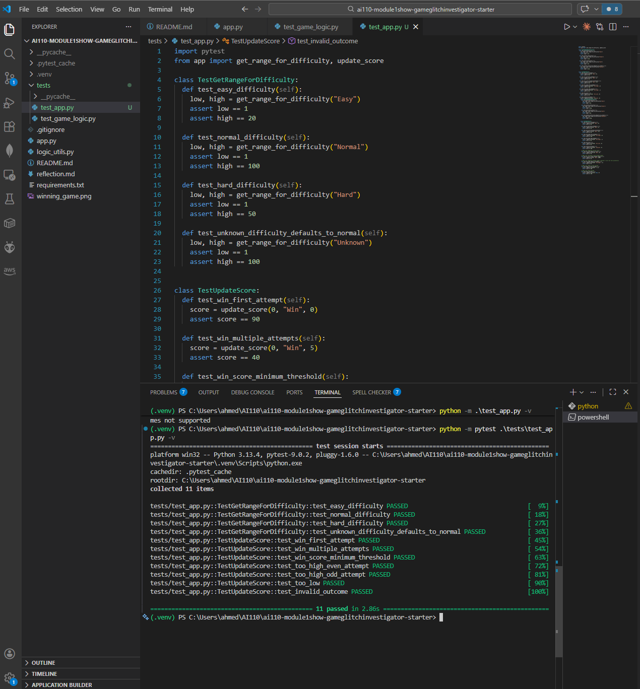
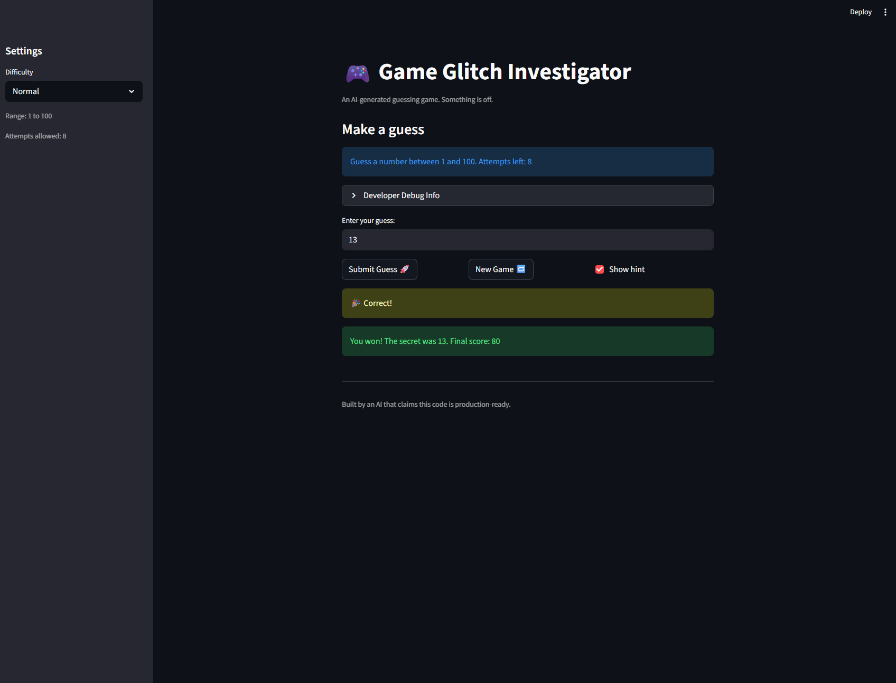

# 🎮 Game Glitch Investigator: The Impossible Guesser

## 🚨 The Situation

You asked an AI to build a simple "Number Guessing Game" using Streamlit.
It wrote the code, ran away, and now the game is unplayable.

- You can't win.
- The hints lie to you.
- The secret number seems to have commitment issues.

## 🛠️ Setup

1. Install dependencies: `pip install -r requirements.txt`
2. Run the broken app: `python -m streamlit run app.py`

## 🕵️‍♂️ Your Mission

1. **Play the game.** Open the "Developer Debug Info" tab in the app to see the secret number. Try to win.
2. **Find the State Bug.** Why does the secret number change every time you click "Submit"? Ask ChatGPT: _"How do I keep a variable from resetting in Streamlit when I click a button?"_
3. **Fix the Logic.** The hints ("Higher/Lower") are wrong. Fix them.
4. **Refactor & Test.** - Move the logic into `logic_utils.py`.
   - Run `pytest` in your terminal.
   - Keep fixing until all tests pass!

## 📝 Document Your Experience

- [x] **Game's purpose:** The Game Glitch Investigator is a number-guessing game. The player picks a difficulty, then tries to guess a secret number within a limited number of attempts, receiving "Go HIGHER!" or "Go LOWER!" hints after each wrong guess.

- [x] **Bugs found:**
  1. The guess hints were backwards, when the guess was too high it said "Go HIGHER!" and when it was too low it said "Go LOWER!", making the game impossible to play correctly.
  2. The remaining attempts were off by one.
  3. On every even-numbered attempt, the secret number was converted to a string before comparison, so the guess always failed on those turns, making it seem like the secret number kept changing.

- [x] **Fixes applied:**
  1. Swapped the comparison conditions in `check_guess` so that `guess > secret` returns "Go LOWER!" and `guess < secret` returns "Go HIGHER!".
  2. Initialized the attempt counter to 0 instead of 1 so the first guess is counted as attempt 1.
  3. Removed the code that converted the secret to a string on even attempts, so `check_guess` always compares the guess against the integer secret.
  4. Refactored the game logic (`check_guess`, `parse_guess`) into `logic_utils.py` and ran `pytest` to verify correctness.

## 📸 Demo

- [x] 

## 🚀 Stretch Features
- [x] 

- [ ] [If you choose to complete Challenge 4, insert a screenshot of your Enhanced Game UI here]
